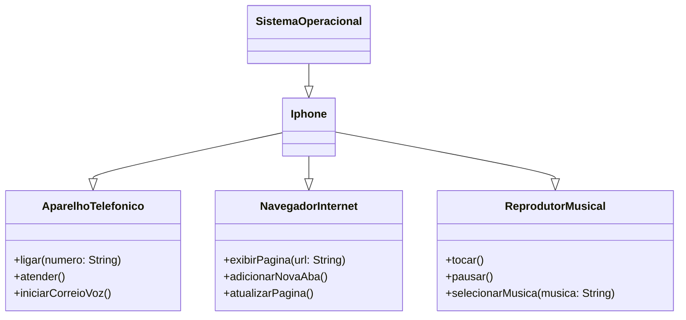

# POO - Desafio

## Modelagem e Diagramação de um Componente iPhone

>Este repositório, concebido com propósitos didáticos, representa um desafio de modelagem e diagramação, utilizando UML, para um componente iPhone, abrangendo suas funcionalidades como reprodutor musical, aparelho telefônico e navegador na internet, criado em colaboração entre a Digital Innovation One e a Claro, como parte do Bootcamp Coding The Future Claro - Java com Spring Boot

## Objetivo

>Aprender e aplicar os fundamentos de Programação Orientada a Objetos (POO) e Linguagem de Modelagem Unificada (UML), os quais incluem:

- Conceito de POO;
- Classes e pacotes;
- Visibilidade dos recursos;
- PIlares do POO;
- Interface.

## Ferramentas

 

## Diagrama UML

> O diagrama UML foi criado utilizando a sintaxe [Mermaid](https://www.mermaidchart.com/), uma alternativa open-source e que é compatível com arquivos Markdown.

